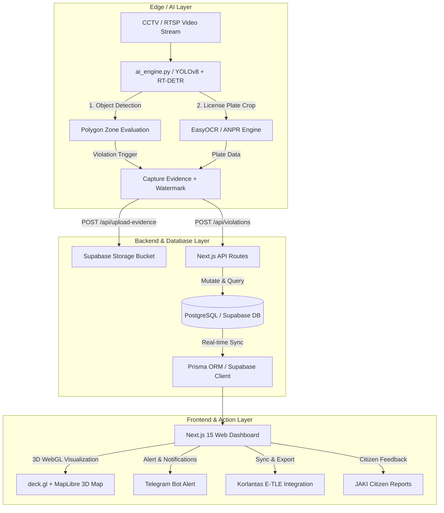
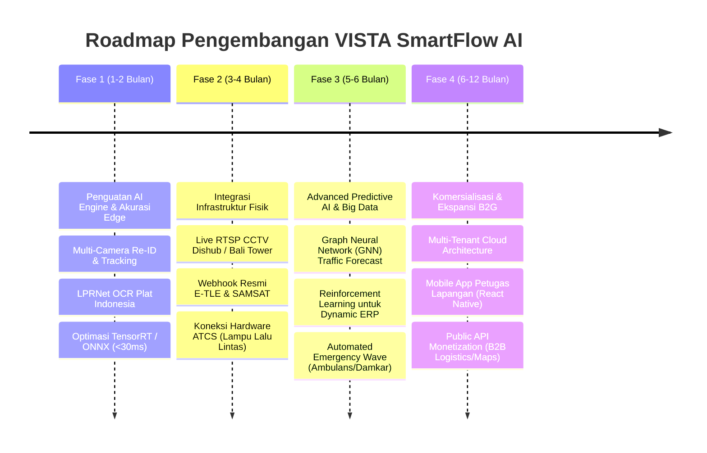

# 🚦 VISTA SmartFlow AI — Deskripsi Project & Roadmap Pengembangan

> [!IMPORTANT]
> **VISTA SmartFlow AI** adalah platform **Intelligent Transport System (ITS)** dan dashboard web enterprise B2G (*Business-to-Government*) berbasis Artificial Intelligence (AI) yang dirancang untuk memodernisasi pemantauan lalu lintas, penegakan hukum lalu lintas (E-TLE), dan manajemen transportasi cerdas di DKI Jakarta dan kota-kota besar lainnya.

---

## 📑 Daftar Isi
1. [Latar Belakang & Visi Project](#1-latar-belakang--visi-project)
2. [Arsitektur & Alur Kerja Sistem](#2-arsitektur--alur-kerja-sistem)
3. [Detail Fitur & Modul Saat Ini](#3-detail-fitur--modul-saat-ini)
4. [Tech Stack & Teknologi yang Digunakan](#4-tech-stack--teknologi-yang-digunakan)
5. [🚀 Roadmap & Next Perkembangan (Langkah Selanjutnya)](#5--roadmap--next-perkembangan-langkah-selanjutnya)
   - [Fase 1: Penguatan AI Engine & Akurasi Edge (1–2 Bulan)](#fase-1-penguatan-ai-engine--akurasi-edge-12-bulan)
   - [Fase 2: Integrasi Infrastruktur Fisik & Real-World API (3–4 Bulan)](#fase-2-integrasi-infrastruktur-fisik--real-world-api-34-bulan)
   - [Fase 3: Advanced Predictive AI, Big Data & Otomasi (5–6 Bulan)](#fase-3-advanced-predictive-ai-big-data--otomasi-56-bulan)
   - [Fase 4: Komersialisasi, Multi-Tenant & Ekspansi Global (6–12 Bulan)](#fase-4-komersialisasi-multi-tenant--ekspansi-global-612-bulan)
6. [Kesimpulan & Action Items Terdekat](#6-kesimpulan--action-items-terdekat)

---

## 1. Latar Belakang & Visi Project

Metropolitan seperti Jakarta menghadapi tantangan mobilitas yang kompleks: kemacetan kronis, pelanggaran jalur steril TransJakarta, parkir liar yang memakan badan jalan, serta peningkatan emisi karbon. Metode pengawasan manual oleh petugas di lapangan memiliki keterbatasan fisik, biaya tinggi, dan tidak bekerja 24/7.

**VISTA SmartFlow AI** hadir sebagai solusi komprehensif yang menggabungkan:
- **Computer Vision (YOLOv8 & RT-DETR)** di sisi *Edge* untuk mendeteksi pelanggaran secara otomatis dari video stream CCTV.
- **Automatic Number Plate Recognition (ANPR)** untuk mengidentifikasi identitas kendaraan secara real-time.
- **Geospatial 3D Analytics & Dashboard Command Center** untuk memberikan wawasan berbasis data kepada pengambil kebijakan (Dinas Perhubungan, Korlantas Polri, dan Pemprov DKI).

---

## 2. Arsitektur & Alur Kerja Sistem

Sistem ini dirancang dengan arsitektur **hybrid edge-cloud** yang memisahkan pemrosesan video berat di *AI Engine* dengan visualisasi interaktif di *Web Dashboard*.

### Cara Kerja Utama:
1. **Ingest & Detect**: `ai_engine.py` membaca frame video dari CCTV/RTSP, mendeteksi kendaraan, dan melacak pergerakan (*tracking*).
2. **Zone Evaluation**: Menggunakan poligon koordinat untuk menentukan apakah kendaraan berada di zona terlarang (misal: zona merah parkir liar atau jalur oranye TransJakarta).
3. **ANPR & Rule Check**: Mengecek aturan kebijakan (seperti jam berlaku Ganjil-Genap dan angka akhir plat nomor).
4. **Evidence Generation**: Jika pelanggaran terdeteksi, sistem memotong gambar (*cropping*), menambah watermark waktu & lokasi, lalu mengirimkannya ke server backend.
5. **Action & Command**: Dashboard menampilkan live counter, pemetaan hotspot 3D, serta memungkinkan petugas memverifikasi tilang untuk dikirim ke sistem E-TLE Korlantas.

---

## 3. Detail Fitur & Modul Saat Ini

Saat ini, **VISTA SmartFlow AI** telah memiliki **19 halaman operasional** dan **19 API endpoints** yang terbagi dalam beberapa modul utama:

| Modul Utama | Halaman / Fitur | Deskripsi & Kegunaan |
| :--- | :--- | :--- |
| **🚨 Operasional & CCTV** | `/` (Dashboard Utama) `/violations` (Manajemen Pelanggaran) `/cameras` (Monitor CCTV) | Menampilkan live counter pelanggaran, simulasi traffic 3D, tabel filter verifikasi pelanggaran (Pending/Verified/Exported), dan monitoring grid status kesehatan CCTV. |
| **🗺️ Geospatial & Heatmap** | `/heatmap` (3D Hotspot) `/peta` (Peta Lalu Lintas) | Visualisasi **deck.gl HexagonLayer** interaktif di atas peta gelap 3D gedung Jakarta untuk melihat akumulasi titik buta dan distribusi pelanggaran. |
| **🏛️ Pilot Koridor & Kebijakan** | `/executive` (Executive View) `/accident-prediction` (Prediksi Kecelakaan) `/ganjil-genap` `/erp` (Simulasi Tarif Tol) | Dashboard pimpinan untuk menghitung estimasi Pendapatan Asli Daerah (PAD) dari denda, prediksi risiko kecelakaan AI di 5 simpang utama, serta monitor aturan Ganjil-Genap & ERP dinamis. |
| **🏙️ Smart City Modules** | `/command-center` (War Room) `/anpr-national` (DB Nasional) `/carbon-tracker` (Emisi CO₂) `/adaptive-traffic` (Lampu Adaptif) | Pusat kendali darurat (*Dispatch system*), pengecekan plat nomor terhadap DB DPO/Curian & SAMSAT, kalkulator penurunan emisi gas buang, serta simulasi lampu merah adaptif AI. |
| **🤝 Integrasi & Analitik** | `/citizen-report` (Laporan Warga) `/traffic-forecast` (Prediksi Macet) `/vehicle-tracking` (Lacak Kendaraan) `/expansion-hub` (Ekspansi SaaS) | Integrasi laporan foto warga bergaya aplikasi JAKI, peramalan kemacetan 24 jam ke depan, pelacakan trajektori kendaraan, serta simulator pendapatan SaaS B2G untuk ekspansi ke 8 kota RI & 5 negara ASEAN. |
| **⚙️ Admin & Keamanan** | `/audit-log` `/reports` `/settings` | Pencatatan jejak audit (*audit trail*) keamanan, manajemen role pengguna (Admin, Officer, Viewer) via NextAuth, dan ekspor laporan berkala. |

---

## 4. Tech Stack & Teknologi yang Digunakan

> [!NOTE]
> Proyek ini dibangun menggunakan teknologi modern bernuansa *cyberpunk / glassmorphism* yang berfokus pada performa tinggi dan pengalaman pengguna (UX) kelas premium.

- **Frontend Architecture**: Next.js 15 (App Router), React 19, TypeScript, Tailwind CSS v4.
- **Geospatial & 3D Rendering**: `deck.gl`, `@deck.gl/aggregation-layers` (Hexagon Layer), `maplibre-gl`, `react-map-gl`, dan Framer Motion.
- **Backend & Database**: Next.js Server Actions & API Routes, PostgreSQL, Supabase (Database & Storage Bucket), Prisma ORM, NextAuth.js.
- **AI & Computer Vision (Edge)**: Python 3, Ultralytics YOLOv8 (v8s/v8n) & RT-DETR, OpenCV, EasyOCR, NumPy.
- **DevOps & Containerization**: Docker, Docker Compose.

---

## 5. 🚀 Roadmap & Next Perkembangan (Langkah Selanjutnya)

Untuk membawa **VISTA SmartFlow AI** dari tahap *Minimum Viable Product (MVP)* & Pilot Project menuju **implementasi riil berskala nasional**, pengembangan selanjutnya dibagi ke dalam **4 Fase Strategis**:

---

### Fase 1: Penguatan AI Engine & Akurasi Edge (1–2 Bulan)
*Fokus: Meningkatkan ketajaman mata AI dan efisiensi komputasi pada perangkat keras.*

1. **Implementasi Multi-Camera Tracking (Re-Identification / Re-ID)**
   - **Mengingat Apa**: Saat ini sistem melacak kendaraan per kamera. Next step adalah menggabungkan **DeepSORT / ByteTrack** dengan model Re-ID (misal *OSNet*) agar kendaraan yang sama dapat dilacak saat berpindah dari satu persimpangan ke persimpangan lain tanpa menggandakan ID.
   - **Target**: Fitur `/vehicle-tracking` dapat menampilkan rute perjalanan utuh satu kendaraan di peta Jakarta.
2. **Spesialisasi OCR Plat Nomor Indonesia (LPRNet / Fine-Tuned OCR)**
   - **Mengingat Apa**: Mengganti atau meningkatkan *EasyOCR* umum dengan model **LPRNet / PaddleOCR** yang telah di-fine-tune khusus pada dataset plat nomor Indonesia (plat hitam, putih, kuning, merah, serta font standar SAMSAT).
   - **Target**: Akurasi pembacaan karakter (*Character Recognition Rate*) meningkat dari ~85% menjadi **>98%**, termasuk pada kondisi malam hari (low-light) dan hujan deras.
3. **Optimalisasi Inference Speed (TensorRT & ONNX Runtime)**
   - **Mengingat Apa**: Mengonversi bobot model `.pt` (YOLOv8 & RT-DETR) ke format **NVIDIA TensorRT** atau **ONNX**.
   - **Target**: Latency pemrosesan turun dari ~80ms menjadi **<30ms per frame**, memungkinkan satu server GPU Edge (misal NVIDIA Jetson Orin atau T4) memproses hingga **16-24 stream CCTV sekaligus** secara real-time 30 FPS.
4. **Penambahan Kategori Pelanggaran Baru**
   - Menambahkan deteksi AI untuk:
     - 🏍️ **Tidak memakai helm** (bagi pengendara motor).
     - 🛑 **Pelanggaran Lampu Merah (*Red-Light Running*)** dengan menyinkronkan status warna lampu lalu lintas di dalam frame video.
     - ⚡ **Batas Kecepatan (*Speeding*)** melalui estimasi kecepatan berbasis *optical flow* dan kalibrasi jarak jalan (*homography projection*).

---

### Fase 2: Integrasi Infrastruktur Fisik & Real-World API (3–4 Bulan)
*Fokus: Menghubungkan dashboard dengan ekosistem perangkat keras DKI Jakarta dan Polri.*

1. **Koneksi Live RTSP CCTV Dishub & Bali Tower**
   - Mengganti video feed simulasi (`traffic-hd.mp4`) pada `proxy.ts` dengan stream RTSP asli dari kamera-kamera persimpangan Dishub DKI Jakarta (misal koridor Sudirman-Thamrin dan Gatot Subroto).
2. **Integrasi Webhook Resmi E-TLE Korlantas & SAMSAT Polri**
   - Membangun API Gateway yang diamankan dengan **mTLS & OAuth2**.
   - Saat petugas menekan tombol *"Verify & Export to E-TLE"* di halaman `/violations`, payload JSON beserta bukti foto tersertifikasi akan dikirim langsung ke server Korlantas untuk pembuatan surat tilang resmi secara otomatis.
3. **Koneksi Hardware ATCS (*Area Traffic Control System*)**
   - Menghubungkan algoritma di `/adaptive-traffic` dengan protokol controller lampu lalu lintas fisik (seperti protokol NTCIP atau SCATS).
   - AI dapat mengubah durasi lampu hijau secara otomatis di persimpangan yang macet secara riil.
4. **Sinergi API JAKI (*Jakarta Kini*)**
   - Membuka endpoint dua arah dengan Jakarta Smart City. Laporan warga dari aplikasi JAKI akan otomatis dipetakan ke CCTV terdekat untuk diverifikasi oleh AI dalam hitungan detik.

---

### Fase 3: Advanced Predictive AI, Big Data & Otomasi (5–6 Bulan)
*Fokus: Mengubah sistem dari "reaktif" (mencatat pelanggaran) menjadi "proaktif" (mencegah macet dan kecelakaan).*

1. **Graph Neural Network (GNN) untuk Spatio-Temporal Traffic Forecasting**
   - Mengupgrade modul `/traffic-forecast`. Jalanan Jakarta dimodelkan sebagai *Graph* (titik persimpangan sebagai node, jalan sebagai edge).
   - AI memprediksi **efek domino kemacetan (*spillover congestion*)** 2 hingga 4 jam ke depan, dan secara otomatis menyarankan pengalihan arus ke papan informasi digital (VMS - *Variable Message Sign*) di jalan tol/arteri.
2. **Reinforcement Learning untuk Dynamic ERP (*Electronic Road Pricing*)**
   - Mengembangkan algoritma *Q-Learning / PPO* pada modul `/erp` yang mampu menyesuaikan tarif tol dalam kota secara dinamis setiap 15 menit berdasarkan volume kendaraan aktual dan target kecepatan rata-rata koridor (>30 km/jam).
3. **Automated Emergency Green Wave (Jalur Hijau Darurat)**
   - Jika sistem mendeteksi ambulan atau pemadam kebakaran yang membunyikan sirine/strobo (melalui pemrosesan audio-visual CCTV), AI akan memberi perintah ke ATCS untuk menciptakan **"Green Wave"** (lampu hijau beruntun) di sepanjang rute yang akan dilalui kendaraan darurat tersebut.
4. **Otomasi Laporan Audit Karbon (ESG Reporting)**
   - Menghubungkan data di `/carbon-tracker` dengan sistem pelaporan emisi Kementerian Lingkungan Hidup dan Kehutanan (KLHK) serta bursa karbon nasional sebagai bukti nyata kontribusi ITS terhadap penurunan emisi Gas Rumah Kaca (GRK).

---

### Fase 4: Komersialisasi, Multi-Tenant & Ekspansi Global (6–12 Bulan)
*Fokus: Mentransformasi platform menjadi produk B2G / B2B SaaS yang siap dijual ke berbagai kota dan negara.*

1. **Arsitektur Multi-Tenant Cloud SaaS**
   - Restrukturisasi database PostgreSQL/Supabase agar mendukung *Multi-Tenancy* (isolasi data per kota/instansi).
   - Satu platform VISTA dapat melayani **Dishub Surabaya, Dishub Bandung, IKN Nusantara, hingga Manila dan Kuala Lumpur** dengan subdomain dan konfigurasi kebijakan yang berbeda-beda (sesuai modul `/expansion-hub`).
2. **Mobile App Petugas Lapangan (*VISTA Officer Pocket*)**
   - Membangun aplikasi mobile lintas platform (**React Native / Flutter**) untuk petugas Dishub dan Polantas di lapangan.
   - **Fitur App**: Menerima push notification real-time saat ada parkir liar atau DPO terdeteksi di radius <500 meter, lengkap dengan navigasi GPS ke lokasi, tombol konfirmasi penindakan, dan scanner plat nomor via kamera HP.
3. **API Monetization & B2B Data Ecosystem**
   - Menyediakan **Public Traffic API** berbayar (berbasis langganan / API call) bagi pihak ketiga:
     - **Perusahaan Logistik & Fleet Management**: Untuk rute pengiriman barang tercepat yang bebas ganjil-genap dan macet.
     - **Ride-Hailing (Gojek / Grab / Uber)**: Untuk optimasi estimasi waktu jemput (ETA).
     - **Platform Navigasi (Google Maps / Waze)**: Sharing data insiden real-time dari CCTV AI.

---

## 6. Kesimpulan & Action Items Terdekat

> [!TIP]
> **Apa yang harus dikerjakan tim programmer / AI engineer minggu ini?**
> Untuk memulai transisi dari status saat ini menuju **Fase 1**, berikut adalah *Action Items* prioritas yang disarankan:

1. **[AI Engineer]**: Mulai mengumpulkan atau mengunduh dataset gambar plat nomor Indonesia dari Roboflow, lalu lakukan fine-tuning model **YOLOv8-plate-detection** & **LPRNet** khusus karakter Indonesia.
2. **[Backend / DevOps]**: Konversi script `ai_engine.py` agar mendukung pembacaan multi-processing dari file konfigurasi daftar URL RTSP eksternal (bukan hanya satu video MP4 lokal).
3. **[Frontend / UI]**: Tambahkan halaman detail per-kendaraan (*Vehicle Journey History*) pada modul `/vehicle-tracking` untuk mempersiapkan visualisasi data dari fitur Multi-Camera Re-ID.
4. **[System Architecture]**: Buat skema tabel baru di Prisma (`VehicleTrajectory` dan `CameraNetwork`) untuk menyimpan jejak koordinat kendaraan lintas waktu.

---
*Dokumen ini dibuat dan diperbarui secara otomatis oleh sistem AI Assistant sebagai panduan pengembangan strategis project **VISTA SmartFlow AI**.*
